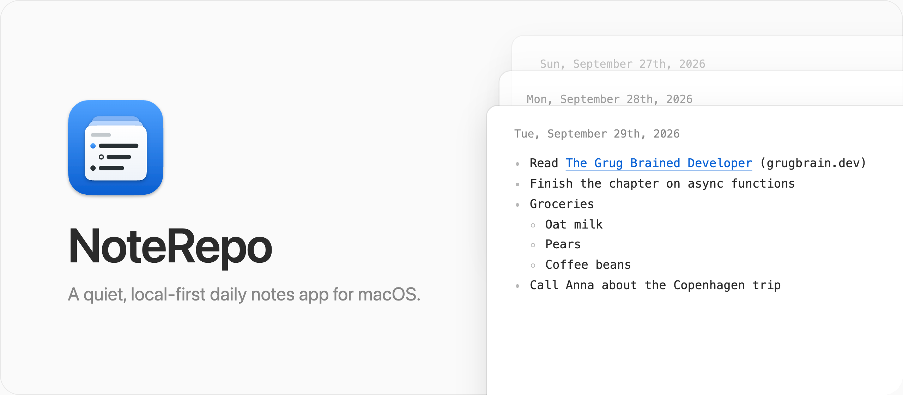
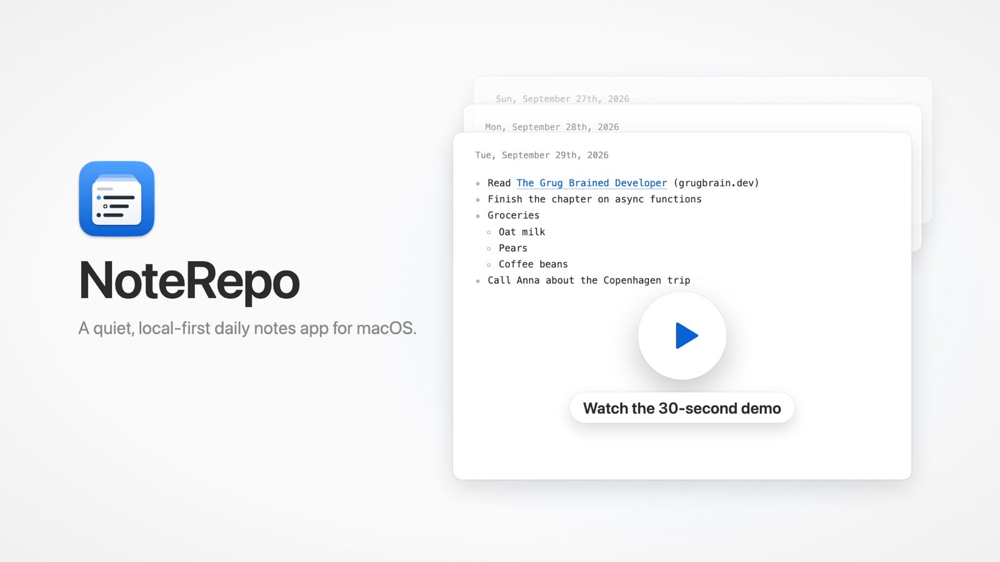
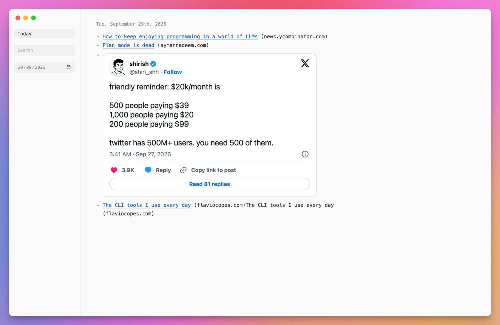

<picture>
  <source media="(prefers-color-scheme: dark)" srcset="docs/banner-dark.png" />
  
</picture>

NoteRepo opens on today, which fills the whole window. Scroll up to see earlier days. Only the days where you wrote something show up, and there are no future days.

There are no accounts, AI tools, or calendar integrations. Your notes live in a SQLite file on your Mac.

Read the announcement on my blog: [I built NoteRepo, a quiet daily notes app for macOS](https://flaviocopes.com/noterepo/).

[](https://github.com/flaviocopes/noterepo/raw/main/docs/showreel.mp4)

## Download

Get `NoteRepo-1.0.0-arm64.zip` from the [latest release](https://github.com/flaviocopes/noterepo/releases/latest), unzip it, and drag NoteRepo to your Applications folder. The build runs on Apple silicon Macs. On an Intel Mac, [build it from source](#run-it-from-source).

The app is ad-hoc signed but not notarized, so macOS blocks it the first time you open it. Open **System Settings → Privacy & Security**, find NoteRepo, and choose **Open Anyway**. If macOS says the app is damaged, run `xattr -dr com.apple.quarantine /Applications/NoteRepo.app` and open it again.

## Features

- Today is always ready to write in, starting with a bullet
- Continuous scrolling back through the days that have notes
- Bulleted and numbered lists started with `-` or `1.`
- Nested list items with `Tab` and `Shift+Tab`
- Automatic saving
- Fast text search
- Pasted URLs become links showing the page title and domain, and a link pasted on its own starts a new bullet
- Pasted text is cleaned of stray blank lines, trailing spaces, and invisible characters
- Rich previews for X and Twitter links pasted on their own line
- Images added by dragging a file into a day or pasting from the clipboard
- Image items you can select and delete, drag within a day, or move to another day
- A date picker that jumps to the closest day with notes
- Light and dark appearance following the macOS setting



## Keyboard shortcuts

| Shortcut | Action |
| --- | --- |
| `⌘D` | Go back to today and start writing |
| `⌘K` | Search your notes |
| `⌥↑` / `⌥↓` | Move to the previous or next day |
| `Tab` / `Shift+Tab` | Indent or outdent a list item |

## Privacy

NoteRepo goes online in only two cases, and neither one sends your notes anywhere:

- When you paste a link, it downloads that page to read its title.
- When a note contains an X post, it loads the preview from `platform.twitter.com`.

## Run it from source

You need macOS and [Node.js](https://nodejs.org) 22.13 or later.

Install the dependencies:

```sh
npm install
```

Build the interface and open the app:

```sh
npm run dev
```

## Build the macOS app

```sh
npm run package:mac
```

The app appears in `release/mac-arm64/NoteRepo.app` on Apple silicon Macs. Drag it to your Applications folder.

The build is ad-hoc signed and not notarized. If macOS blocks a copy you downloaded or moved from another Mac, open **System Settings → Privacy & Security**, find NoteRepo, and choose **Open Anyway**. You don't need to disable Gatekeeper.

## Where your notes live

Notes and images are stored in one SQLite database:

```text
~/Library/Application Support/NoteRepo/notes.sqlite3
```

The development and packaged apps share this file, so back it up like any other document.

NoteRepo accepts PNG, JPEG, GIF, WebP, and safe SVG images up to 15 MB each. Identical images are stored only once.

## Import from Reflect

If you're coming from [Reflect](https://reflect.app), export your notes as JSON and import the daily notes.

Quit NoteRepo first, then preview what would change:

```sh
node scripts/import-reflect.cjs \
  --source ~/Downloads/reflect-export.json \
  --database ~/Library/Application\ Support/NoteRepo/notes.sqlite3 \
  --dry-run
```

Run the same command without `--dry-run` to import. The script backs up your database next to it first, downloads your Reflect images into NoteRepo, and appends Reflect notes to days that already have notes. Running it twice doesn't duplicate anything.

## Development

Run the type check, the build, and the unit tests:

```sh
npm run check
```

The `test/electron-*-check.cjs` scripts drive the running app through the Chrome DevTools Protocol. Start the packaged app with remote debugging turned on:

```sh
open -a release/mac-arm64/NoteRepo.app --args --remote-debugging-port=9333
```

Copy the page's `webSocketDebuggerUrl` from `http://127.0.0.1:9333/json` and pass it to each check:

```sh
node test/electron-cdp-check.cjs ws://127.0.0.1:9333/devtools/page/<id>
node test/electron-feed-check.cjs ws://127.0.0.1:9333/devtools/page/<id>
node test/electron-import-check.cjs ws://127.0.0.1:9333/devtools/page/<id> 2026-09-05
```

The import check also needs a date whose note contains an image.

Be careful: these checks use your real notes database. They edit today's note and restore it afterwards, and they write to a few days in December 1999. Keep the NoteRepo window visible while they run, because macOS pauses hidden windows.

The app icon lives in `resources/AppIcon.svg`. After editing it, regenerate the PNGs used by the build:

```sh
npm run icon
```

The README banner is `docs/banner.html`, styled with the app's own stylesheet. Regenerate the light and dark PNGs with:

```sh
npm run banner
```

## How it works

Astro builds the interface. HTMX loads earlier days as you scroll up. Alpine.js tracks the active day, grows each editor, and saves your writing.

Electron runs a small server bound to `127.0.0.1`. It stores notes and images in SQLite through Node's built-in `node:sqlite` module, fetches the titles of pasted links, and opens web links in your default browser. The renderer is sandboxed and has no direct access to Node.js.

## License

[MIT](LICENSE)
